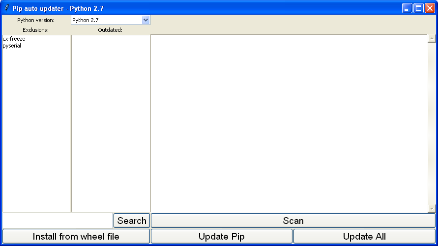

# python-auto-pip
simple tkinter GUI to automate updating python pip packages

This simple python script will scan your computer for python installations (currently windows only)
then select a version to look at updating packages for that version.  
Tested with python versions 2.7 and 3.4, it is not required to run the script in the version of python you wish to update.

There are five buttons:
1) Search: search for pip packages, results are shown in the output text box, with links to install
2) Install from Wheel file: prompt user with a file dialog for a wheel file to install.
3) Scan: check for packages that are out of date, which will be shown in a list on the left hand side. linksin output text box can be used to update specific packages
4) Update Pip: (self explanatory)
5) Apdate All: will update all out of date packages. will prompt to update pip first if that is required.

The lists on the left can be used to add or remove exclusions (packages that won't be updated) with a context menu.

The big text box on the right is used to display the console output, commands are shown in black with a leading >  
output from the command is shown in blue and errors shown in red.

When a command is running the buttons will be disabled, and then re-enabled when the command completes.

# Known issues:
1) although packages can be excluded, if another package requires a more up to date version, pip will update that when managing dependancies.
2) the current method of finding python installs assumes default install paths of CPython
3) the current method of finding/running pip is windows specific (I know on linux there is pip and pip3)

I hope this helps someone who is as lazy as me keep their python packages up to date.
